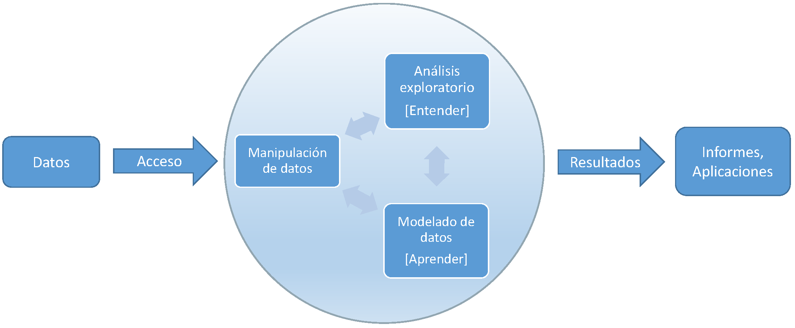

#  Introducción {#intro}

```{r global-options, include=FALSE}
source("_global_options.R")
```

<!-- 
---
title: "Introducción"
author: "Notas de Programación en R"
date: "Rubén Fernández-Casal (rubenfcasal@gmail.com)"
output:
  bookdown::html_document2:
    toc: yes
    # toc_float: yes
    # mathjax: local            # copia local de MathJax, hay que establecer:
    # self_contained: false     # las dependencias se guardan en ficheros externos
    pandoc_args: ["--number-offset", "1,0"]
  bookdown::pdf_document2:
    latex_engine: xelatex
    # keep_tex: yes
    toc: yes 
    pandoc_args: ["--number-offset", "1,0"]
header-includes:
- \usepackage[spanish]{babel}
- \setcounter{section}{1} 
---

bookdown::preview_chapter("01-Introduccion.Rmd")
knitr::purl("01-Introduccion.Rmd", documentation = 2)
knitr::spin("01-Introduccion.R", knit = FALSE)
-->

Como aparece en el prólogo, estos apuntes contienen recomendaciones y notas personales sobre programación en R para el análisis de datos, en el que incluyen referencias a información y recursos adicionales que considero de interés. 
Se tratará de mostrar una forma de llevar a cabo las distintas tareas que pueden surgir en el análisis de datos empleando R, esto no quiere decir que sea la mejor forma de hacerlo o la más cómoda (que dependerá de cada persona).

En estas notas ***se asumen unos conocimientos básicos de R***, un lenguaje de programación (interpretado) y un entorno estadístico desarrollado específicamente para el análisis estadístico.
Puede ser una herramienta de gran utilidad a lo largo de todo el proceso de obtención de información a partir de datos `r cite_fig("esquema")`. 

```{r esquema, echo=FALSE, fig.cap="Etapas del proceso"}

```

Para una introducción a la programación en R se puede consultar el libro:

Fernández-Casal R., Roca-Pardiñas J., Costa J. y Oviedo-de la Fuente M. (2022). *[Introducción al Análisis de Datos con R](https://rubenfcasal.github.io/intror)* ([github](https://github.com/rubenfcasal/intror)).

Adicionalmente, en este [post](https://rubenfcasal.github.io/post/ayuda-y-recursos-para-el-aprendizaje-de-r) se incluyen enlaces a recursos adicionales, incluyendo libros y cursos, que pueden ser útiles para el aprendizaje de R.

El primer paso es la instalación de R, para ello se recomienda seguir los pasos en este [post](https://rubenfcasal.github.io/post/instalacion-de-r).

Para el desarrollo de código e informes la recomendación es emplear *RStudio Desktop*, que se puede instalar y configurar siguiendo las indicaciones en este [post](https://rubenfcasal.github.io/post/instalacion-de-rstudio).
También puede resultar de interés consultar:

- [RStudio IDE Cheat Sheet](https://posit.co/wp-content/uploads/2022/10/rstudio-ide-1.pdf) (menú de RStudio *Help > Cheat Sheets > RStudio IDE Cheat Sheet*).

- [Using the RStudio IDE](https://support.posit.co/hc/en-us/sections/200107586-Using-the-RStudio-IDE).

Sin embargo, en ciertos casos puede ser recomendable ejecutar el código R directamente desde una ventana de comandos (por ejemplo para ejecutar varios programas de forma simultánea en distintos directorios de trabajo o si los requerimientos computacionales son grandes).
En mi caso, cuando trabajo en Windows, acostumbro a emplear el explorador para situarme en el directorio donde quiero ejecutar código y abrir una ventana de comandos, escribiendo `cmd` en el cuadro superior donde se muestra la ruta.
Posteriormente, como añadí en directorio de instalación de R al *path* (ver [post](https://rubenfcasal.github.io/post/instalacion-de-r/#rtools)), ejecuto^[También se puede ejecutar un script de R de forma no interactiva ejecutando en el intérprete de comandos del sistema operativo: `R CMD BATCH [opciones] mi_script.R [fichero_salida]` (cambiando `R` por la ruta completa, e.g. `"C:\Program Files\R\R-4.2.1\bin\R.exe"`, si no se añadió al path. También se puede incluir en un fichero *.bat*, para poder ejecutarlo repetidas veces con mayor facilidad). Ver [Appendix B Invoking R](https://cran.r-project.org/doc/manuals/r-release/R-intro.html#Invoking-R) de [Introduction to R](https://cran.r-project.org/doc/manuals/r-release/R-intro.html) para información sobre las distintas opciones.] `R` y finalmente un comando de la forma:
```{r eval=FALSE}
source("mi_script.R", echo = TRUE, encoding = "UTF-8") # UTF-8 importante en R < 4.2
```

## Organización {#organizacion}

Para la organización de archivos (datos, código, informes...) lo recomendable es emplear un directorio con la estructura adecuada.

Dependiendo del objetivo puede interesar emplear un proyecto de RStudio (menú *File > New project...*). 
En mi caso empleo esta opción para paquetes, libros en bookdown, webs con blogdown y aplicaciones shiny.
En otros casos empleo una carpeta que puede tener subdirectorios (si el proyecto es más grande) para distintos tipos de archivos o para distintas tareas (con el objetivo de facilitar la búsqueda). 
Por ejemplo: *datos*, *informes*, *resultados_2023*...

Mi recomendación es emplear nombres de archivos y carpetas en minúscula (o con la primera letra en mayúsculas), sin espacios (por ejemplo empleando `_` para separar palabras o iniciales) y sin caracteres especiales (ASCII, sin acentos...).
Los nombres deberían ser lo más descriptivos posibles (en el sentido de evitar confusión). 
Pueden incluirse descripciones más completas en el código, en ficheros de texto (e.g. *Descripcion_archivos.txt*), o incluso en hojas de cálculo.
Yo además acostumbro a incluir archivos del tipo *Notas.txt* (con recordatorios, decisiones...) o *Pendente.txt* (con próximos pasos, mejoras o verificaciones pendientes...).

Además, nos puede interesar establecer opciones de R específicas para el proyecto (por ejemplo opciones de configuración de memoria, de paquetes o variables de entorno, incluyendo claves privadas), de forma que se establezcan automáticamente al iniciar R o RStudio.
Para más detalles ver la ayuda de `?Startup`, el apéndice [Invoking R](https://cran.r-project.org/doc/manuals/r-release/R-intro.html#Invoking-R) o el post de RStudio
[Managing R with .Rprofile, .Renviron, Rprofile.site, Renviron.site, rsession.conf, and repos.conf](https://support.posit.co/hc/en-us/articles/360047157094-Managing-R-with-Rprofile-Renviron-Rprofile-site-Renviron-site-rsession-conf-and-repos-conf)

Para desarrollar código y proyectos de forma colaborativa, la recomendación es emplear un sistema de control de versiones.
Se puede configurar RStudio para emplear Git (ver el libro [Happy Git and GitHub for the useR](https://happygitwithr.com/index.html) o la sección [Git and GitHub](https://r-pkgs.org/software-development-practices.html#sec-sw-dev-practices-git-github)), sin embargo yo prefiero emplear [GitHub Desktop](https://desktop.github.com/).


### Código e informes {#codigo}

Mi recomendación a la hora de escribir código es seguir un **proceso iterativo**. 
Se comienza realizando pruebas y al finalizar cada etapa se trata de reorganizar el código (adaptándolo al estilo de programación elegido, lo que incluiría añadir comentarios y secciones) de forma que sea más cómodo continuar trabajando en siguientes etapas (y si es posible que resulte más fácil de adaptar para otros casos).

En el caso de informes el proceso sería similar, empleando como punto de partida un fichero de código en formato [spin](https://yihui.org/knitr/demo/stitch/#spin-comment-out-texts) (ver Sección  \@ref(spin)), en el que el texto RMarkdown se incluye como un comentario de código empleando `#' `. Por ejemplo:
```
#' # Sección
#'
#' ## Subsección
#'
#' Texto rmarkdown...
```

En primer lugar me preocupo de escribir un código funcional y, además de ir añadiendo comentarios de la forma habitual, voy añadiendo secciones y texto rmarkdown en formato spin.
Finalmente, cuando tengo una primera versión del código (que puedo ir previsualizando; en RStudio basta con pulsar^[Para mostrar las combinaciones de teclas en RStudio podemos emplear el menú *Tools > Keyboard Shortcuts Help*.] *Ctrl + Shift + K*, el icono correspondiente en la barra superior, o seleccionar *File > Compile Report...*), lo transformo a formato *.Rmd* con un comando de la forma:

```{r eval=FALSE}
knitr::spin("Informe.R", knit = FALSE)
```

donde termino de redactar (`knitr::purl("Informe.Rmd", documentation = 2)` genera un nuevo fichero *Informe.R* donde resulta más cómodo modificar o desarrollar código).


Se recomienda **elegir un estilo que sea consistente y seguirlo por completo** en todo el proyecto.
Lo principal sería el operador de asignación, el espaciado y el estilo de nombres (de objetos, variables o ficheros):

- `estilo.clasico`: es el estilo del paquete base de R. Muchos programadores no lo recomiendan (principalmente porque este separador no se admite en otros lenguajes y porque puede dar lugar a confusión con métodos S3, ver Sección \@ref(oop)).

- `estilo_serpiente` (o `Estilo_serpiente`): es el estilo de la colección de paquetes `r cite_pkg(tidyverse)`.

- `EstiloCamello` (o `estiloCamello`): es el estilo (casi obligatorio) para las clases `r cite_pkg(R6)` (ver Sección \@ref(oop)). El paquete `r cite_pkg(shiny)` emplea la variante que comienza por minúsculas.

**Recomiendo emplear `<-`** como operador de asignación y escribir todos los **nombres en minúsculas**.
Yo tengo tendencia a emplear el `estilo.clasico`, sobre todo si el código no depende de paquetes tidyverse (en ese caso suelo emplear `estilo_serpiente`).
También influye el estilo de nombres empleado por la fuente de datos o el requerido en los resultados.

El estilo también debe especificar el sangrado, el espaciado, etc.
Por ejemplo:

- [Tidyverse style guide](https://style.tidyverse.org)

- [Google’s R Style Guide](https://google.github.io/styleguide/Rguide.html)

Para facilitar la legibilidad **es muy recomendable incluir un espacio** entre los elementos del comando.
En RStudio se puede seleccionar un trozo de (una línea de) código y pulsar *Ctrl + Shift + A* para formatearlo.
También podemos emplear el paquete `r cite_pkg(styler)` para formatear el código.
Por ejemplo, en RStudio podemos emplear *Addins > Styler > Style active file*.

Además se recomienda **crear secciones y documentar el código adecuadamente**.
En RStudio se puede crear una sección pulsando *Ctrl + Shift + R* o añadiendo al menos 4 guiones (`-`, también `=` o `#`) después de un comentario.
Por ejemplo:
```{r eval=FALSE}
# Sección ----
## Subsección ----
```

El orden de las secciones y subsecciones es importante.
Al principio del código debería ir:

1. Los parámetros o variables globales. 
2. La carga de paquetes (únicamente los mínimos requeridos).
3. La carga de código externo.
4. La carga de archivos de datos (o al principio de la sección donde se emplean, si son datos auxiliares).

**No se recomienda** emplear rutas absolutas en el código, del tipo:
```{r eval=FALSE}
setwd("C:/Documentos/Proyectos/Proyecto_X")
load("C:/Documentos/Proyectos/Proyecto_X/datos_x.RData")
source("C:/Documentos/Proyectos/R/Herramientas.R")
```

Como punto de partida el directorio de trabajo debería ser la carpeta del proyecto.
Esto ya ocurre por defecto si empleamos proyectos de RStudio o si iniciamos RStudio abriendo un archivo de código en esta carpeta.
En general, la recomendación es asumir que el directorio de trabajo es aquel en el que se encuentra el archivo de código (lo que también ocurre por defecto al compilar un documento RMarkdown).
Si no es el caso se puede emplear el menú *Sesion > Set Working Directory > To Source File Location*.

Para establecer la ruta a archivos o directorios **se recomienda emplear rutas relativas** (usando *../* para acceder a la carpeta anterior; *./* sería el actual directorio de trabajo).
Por ejemplo:
```{r eval=FALSE}
load("datos/datos_x.RData")
source("../R/Herramientas.R")
fecha_txt <- as.character(Sys.Date() - 1, format = "%m_%d") # Por ejemplo...
rmarkdown::render("informe.Rmd", params = list(fecha_txt = fecha_txt),
                  output_file = paste0('informes/informe_', fecha_txt, '.html'), 
                  envir = new.env(), encoding = "UTF-8")
```

La mejor forma de organizar funciones es desarrollar un paquete, como se comenta más adelante en la Sección \@ref(desarrollo).


### Datos {#datos}

La recomendación es emplear ficheros de datos con el formato por defecto de R (datos binarios comprimidos), con extensión *.RData*.
Hay que tener en cuenta que lo esperable es que el archivo contenga un conjunto de datos con el mismo nombre, aunque podría no ser el caso e incluso contener varios objetos.

Uno de los problemas con los ficheros *.RData* es que, al cargarlos con `r cite_fun(load)` de la forma habitual, se añaden al entorno de trabajo los objetos que contienen con los nombres con que se almacenaron (y si ya existe alguno con ese nombre lo sobreescribe)
Para almacenar un único objeto de forma que se pueda cargar posteriormente especificando el nombre, se pueden emplear las funciones `r cite_fun(saveRDS)` y `r cite_fun(readRDS)`.

Sin embargo, lo habitual es que inicialmente los datos procedan de una fuente externa.
Se pueden importar datos externos en casi cualquier formato a R (aunque puede requerir instalar paquetes adicionales). 
Mi recomendación es separar los análisis de la importación de los datos.
Crear un fichero de código específicamente para importar los datos^[Con algunos tipos de datos, se puede emplear los submenús de RStudio *File > Import Dataset*  para seleccionar los ajustes, previsualizando el resultado, y generar el código para importarlos.], hacer el (pre)procesado y guardarlos en formato *.RData*.
Yo habitualmente empleo el mismo nombre para el archivo de código y el archivo de datos que se genera (e.g. *datos.R* contiene el código necesario para generar *datos.RData*; no suelo renombrar el fichero fuente de datos externo, aunque se aleje mucho del estilo elegido).
Asociado a un mismo conjunto de datos puede haber distintos archivos de código para realizar distintos análisis (el nombre de esos archivos debería dar una pista del análisis que realizan).

En muchas ocasiones, para modificar los nombres de las variables o los niveles de un factor, suelo recurrir a la función `r cite_fun(dput)` para escribirlos en modo texto (e.g. `dput(tolower(names(datos)))` o `dput(levels(datos$factor))`) y posteriormente modificarlos a mano.

Yo recomiendo añadir un atributo `variable.labels` que contenga un vector de etiquetas de las variables y empleando como nombres de las componentes las propias variables:
```{r}
data(cars)
# dput(names(cars))
var.lab <- c(speed = "Speed (mph)", dist = "Stopping distance (ft)")
attr(cars, "variable.labels") <- var.lab
str(cars)
# View(cars)
# with(cars, plot(speed, dist, xlab = var.lab["speed"], 
#                 ylab = var.lab["dist"]))
```

Para leer ficheros de Excel acostumbro a utilizar los paquetes  [`openxlsx`](https://cran.r-project.org/web/packages/openxlsx/index.html) (solo para archivos con extensión *.xlsx*) o [`readxl`](https://readxl.tidyverse.org) (colección [`tidyverse`](https://www.tidyverse.org/); Sección \@ref(tidyverse)).
En estos casos además se puede añadir una nueva hoja de cálculo con los nombres de las variables junto con su etiqueta, que se puede cargar y emplear durante el preprocesado.
Adicionalmente esta tabla puede incluir una columna con los nuevos nombres (yo recomiendo no modificar los antiguos en este fichero), otra con un filtro para seleccionar variables (o el orden después del procesado) e incluso una columna con anotaciones o observaciones.
Ver [top500.R](ejemplos/top500/top500.R) en [ejemplos](https://github.com/rubenfcasal/book_notasr/tree/main/ejemplos).


